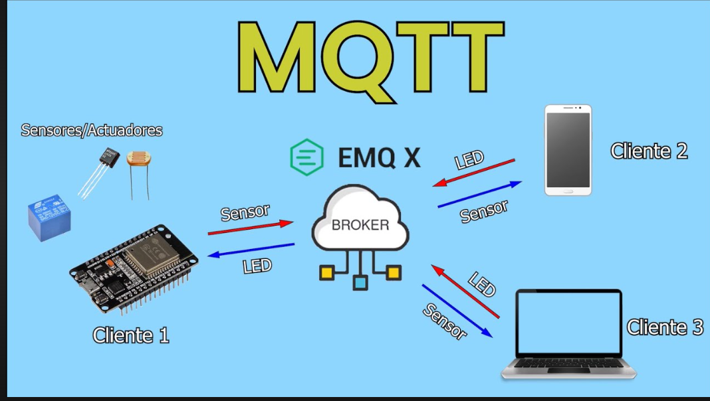
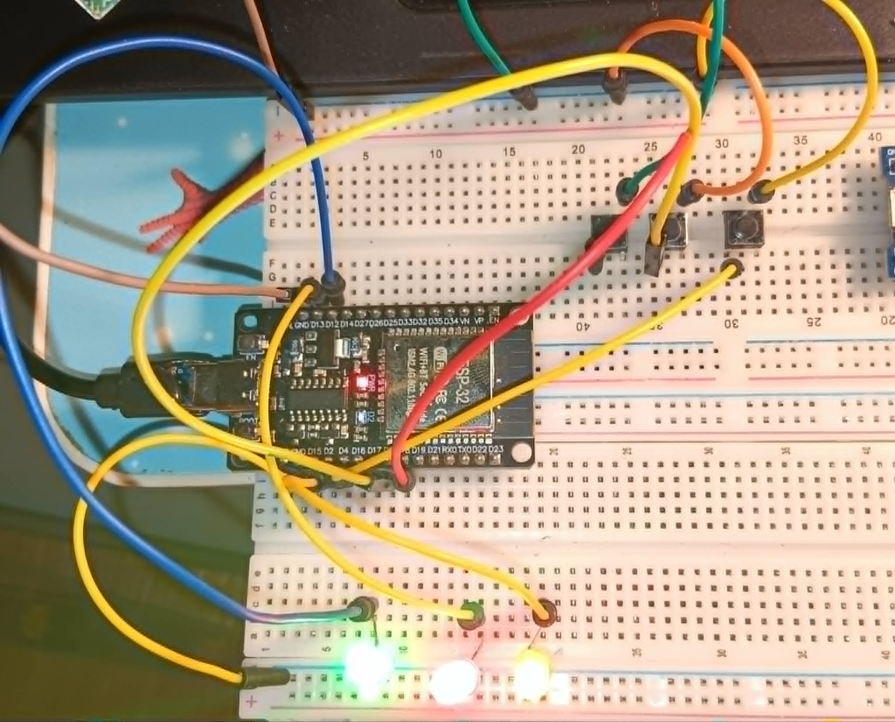
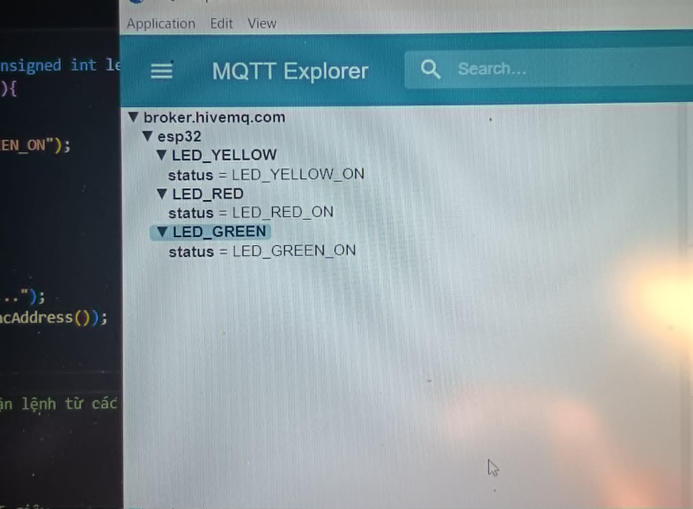
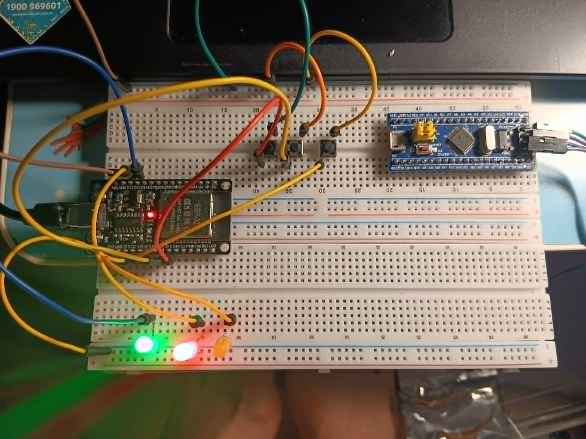
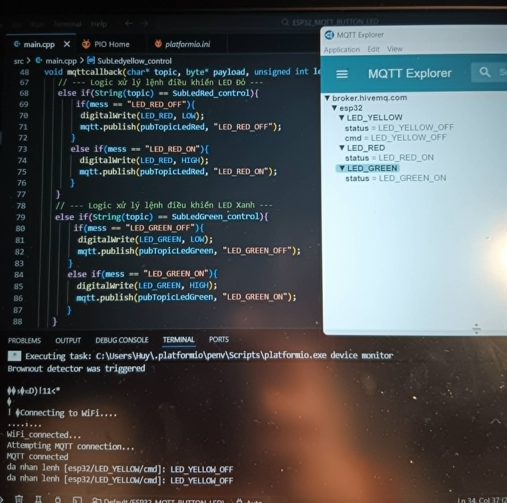

# BÁO CÁO NGHIÊN CỨU ESP32 & GIAO THỨC MQTT
**Người thực hiện:** D23 Lê Đình Huy 


---

##  A. Công việc đã làm
1. **Nghiên cứu lý thuyết:** Tìm hiểu bản chất giao thức MQTT và mô hình Publish/Subscribe.
2. **Cấu hình hệ thống:** Thiết lập môi trường kết nối MQTT cho ESP32 thông qua thư viện `PubSubClient`.
3. **Triển khai :** Hoàn thành Project điều khiển 3 LED, đồng bộ trạng thái giữa nút nhấn vật lý và phần mềm MQTT Explorer.

---

##  B. Công việc chi tiết

### 1. Tìm hiểu về giao thức MQTT
*   **Định nghĩa:** MQTT là giao thức truyền tin nhắn theo mô hình Publish/Subscribe thông qua một máy chủ trung gian gọi là Broker.



*   **Phân tích mô hình hoạt động:**
    *   **Publisher (Người gửi):** ESP32 đọc trạng thái và đẩy dữ liệu lên các địa chỉ cụ thể gọi là **Topic**.
    *   **Subscriber (Người nhận):** Máy tính hoặc App đăng ký vào Topic đó để nhận dữ liệu về theo thời gian thực.
    *   **Broker (Người điều phối):** Đứng ở giữa, tiếp nhận tin nhắn từ người gửi và phân phối chính xác đến những người đăng ký.
    *   **Điều khiển hai chiều:** Các thiết bị bên ngoài có thể gửi lệnh điều khiển ngược về ESP32 thông qua Broker.

---

### 2. Thiết lập chương trình cho ESP32

#### 2.1. Khởi tạo đối tượng kết nối
*   **`WiFiClient espClient;`**: Thiết lập kết nối cơ bản giữa ESP32 với Broker thông qua giao thức TCP/IP.
*   **`PubSubClient mqtt(espClient);`**: Khởi tạo thực thể MQTT chạy trên nền tảng TCP/IP, chịu trách nhiệm đóng gói dữ liệu đúng tiêu chuẩn.

#### 2.2. Các hàm chức năng chính
*   **Hàm `setup_wifi()`**: Đảm bảo ESP32 kết nối mạng thành công trước khi thực hiện các tác vụ khác.
*   **Hàm `reconnect()`**: Xử lý logic tự động kết nối lại nếu gặp sự cố rớt mạng hoặc mất tín hiệu từ Broker.
*   **Hàm `mqttcallback(char* topic, byte* payload, unsigned int length)`**: Xử lý dữ liệu nhận về. Khi có lệnh từ ngoại vi, hàm này tự động sẽ được thực hiện.
   + **`char* topic`**:  là topic mà ESP32 đăng kí để nhận lệnh từ ngoại vi về

  + **`byte* payload`**
    + Là **nội dung dữ liệu nhận từ MQTT Broker**.
    + Dữ liệu được lưu dưới dạng **mảng byte**.
    + Thường cần chuyển sang `char` hoặc `String` để xử lý.
 
  + **`unsigned int length`**
    + Là **độ dài của dữ liệu payload** (số byte).
    + Dùng để biết có bao nhiêu byte dữ liệu trong `payload`.


*   **Hàm `mqtt.loop()`**: Lệnh duy trì sự sống cho kết nối, gửi gói tin giữ nhịp (ping) và giải phóng bộ đệm khi có tin nhắn mới.

#### 2.3. Các lệnh gửi và nhận dữ liệu
*   **`mqtt.publish(topic, payload)`**: Lệnh gửi dữ liệu trạng thái từ ESP32 lên Broker.
*   **`mqtt.subscribe(topic)`**: Lệnh đăng ký nhận dữ liệu từ một chủ đề nhất định trên Broker.

---

### 3. Project: Điều khiển 3 LED qua MQTT & Nút nhấn
*   **Đề tài:** Đọc trạng thái 3 LED hiển thị lên MQTT Explorer, dùng 3 nút nhấn để điều khiển tại chỗ và cho phép điều khiển từ xa qua MQTT Explorer.

####  Mã nguồn chương trình

```
#include <Arduino.h>
#include <PubSubClient.h>
#include <WiFi.h>

#define LED_YELLOW 2
#define LED_RED 13    
#define LED_GREEN 12  

#define BUTTON4 4
#define BUTTON5 5
#define BUTTON18 18

// WiFi
const char* ssid = "TANG03";
const char* password = "0976152886";

// Khởi tạo các đối tượng kết nối
WiFiClient client;
PubSubClient mqtt(client);

// --- Cấu hình MQTT Broker (HiveMQ Cloud) ---
const char* mqtt_sever = "broker.hivemq.com"; 
const int   mqtt_port = 1883;//sử dụng cổng mặc định
//const char* mqtt_user = "ptit";
//const char* mqtt_password = "huytz@12345";


// Topic gửi trạng thái (Publish) từ ESP32 lên MQTT
const char* pubTopicLedYellow = "esp32/LED_YELLOW/status";
const char* pubTopicLedRed = "esp32/LED_RED/status";
const char* pubTopicLedGreen = "esp32/LED_GREEN/status";

// Topic nhận lệnh (Subscribe) từ MQTT về ESP32
const char* SubLedyellow_control = "esp32/LED_YELLOW/cmd";
const char* SubLedRed_control = "esp32/LED_RED/cmd";
const char* SubLedGreen_control = "esp32/LED_GREEN/cmd";

void setup_wifi(){
  Serial.println("Connecting to WiFi....");
  WiFi.begin(ssid, password);
  while(WiFi.status() != WL_CONNECTED){
     delay(500);
     Serial.print('.');
  }
  Serial.println("\nWiFi_connected...");
}

void mqttcallback(char* topic, byte* payload, unsigned int length){
   String mess = ""; 
   //// Chuyển đổi mảng Byte nhận được sang dạng chuỗi (String)
   for(int i=0; i<length; i++){
     mess += (char)payload[i]; 
   }

   Serial.println("da nhan lenh [" + String(topic) + "]: " + mess);
 // --- Logic xử lý lệnh điều khiển LED Vàng ---
   if(String(topic) == SubLedyellow_control){
      if(mess == "LED_YELLOW_OFF"){
        digitalWrite(LED_YELLOW, LOW);
        mqtt.publish(pubTopicLedYellow, "LED_YELLOW_OFF");
      }
      else if(mess == "LED_YELLOW_ON"){
        digitalWrite(LED_YELLOW, HIGH);
        mqtt.publish(pubTopicLedYellow, "LED_YELLOW_ON");
      }
   }
   // --- Logic xử lý lệnh điều khiển LED Đỏ ---
   else if(String(topic) == SubLedRed_control){
       if(mess == "LED_RED_OFF"){
        digitalWrite(LED_RED, LOW);
        mqtt.publish(pubTopicLedRed, "LED_RED_OFF"); 
      }
      else if(mess == "LED_RED_ON"){ 
        digitalWrite(LED_RED, HIGH);
        mqtt.publish(pubTopicLedRed, "LED_RED_ON");
      }
   }
   // --- Logic xử lý lệnh điều khiển LED Xanh ---
   else if(String(topic) == SubLedGreen_control){
       if(mess == "LED_GREEN_OFF"){
        digitalWrite(LED_GREEN, LOW);
        mqtt.publish(pubTopicLedGreen, "LED_GREEN_OFF");
      }
      else if(mess == "LED_GREEN_ON"){
        digitalWrite(LED_GREEN, HIGH);
        mqtt.publish(pubTopicLedGreen, "LED_GREEN_ON");
      }
   }
}

void reconnect() {
  while (!mqtt.connected()) {
    Serial.print("Attempting MQTT connection...");
    String clientId = "ESP32-" + String(WiFi.macAddress());
    // Gửi yêu cầu kết nối tới Broker
    if (mqtt.connect(clientId.c_str())) {
      Serial.println("connected");
     // Sau khi kết nối thành công, đăng ký nhận lệnh từ các topic control
      mqtt.subscribe(SubLedyellow_control);
      mqtt.subscribe(SubLedRed_control);
      mqtt.subscribe(SubLedGreen_control);
    } else {
    // Nếu thất bại, in mã lỗi và thử lại sau 5 giây
      Serial.print("failed, rc=");
      Serial.print(mqtt.state());
      delay(5000);
    }
  }
}

void setup(){
  Serial.begin(9600); 
  pinMode(LED_RED, OUTPUT);
  pinMode(LED_YELLOW, OUTPUT);
  pinMode(LED_GREEN, OUTPUT);

  digitalWrite(LED_RED, LOW);
  digitalWrite(LED_YELLOW, LOW);
  digitalWrite(LED_GREEN, LOW);

//Cấu hình BUTTON
  pinMode(BUTTON4, INPUT_PULLUP);
  pinMode(BUTTON5, INPUT_PULLUP);
  pinMode(BUTTON18, INPUT_PULLUP);

  setup_wifi();
  mqtt.setServer(mqtt_sever, mqtt_port); // Cấu hình địa chỉ và cổng Broker
  mqtt.setCallback(mqttcallback);// Cấu hình hàm xử lý tin nhắn đến
}

// Khởi tạo trạng thái ban đầu là 1 (vì dùng PULLUP nhấn là 0)
int prev_state1 = 1;
int prev_state2 = 1;
int prev_state3 = 1;

// Biến lưu trạng thái bật/tắt hiện tại của LED
int led_yellow_state = 0; 
int led_red_state = 0; 
int led_green_state = 0; 

void loop(){
  // Kiểm tra nếu mất kết nối MQTT thì gọi hàm kết nối lại
  if (!mqtt.connected()) {
    reconnect();
  }
  mqtt.loop();// Duy trì kết nối MQTT và xử lý các gói tin đến/đi
  
  int button1_state = digitalRead(BUTTON4);
  int button2_state = digitalRead(BUTTON5);
  int button3_state = digitalRead(BUTTON18);

  // Xử lý nút 1 - LED Vàng
  if(prev_state1 == 1 && button1_state == LOW){ 
      led_yellow_state = !led_yellow_state;
      if(led_yellow_state != 0){
          digitalWrite(LED_YELLOW, HIGH);
          mqtt.publish(pubTopicLedYellow, "LED_YELLOW_ON");
      }
      else{
          digitalWrite(LED_YELLOW, LOW);
          mqtt.publish(pubTopicLedYellow, "LED_YELLOW_OFF");
      }
      delay(200); // Chống rung nút nhấn
  }
  prev_state1 = button1_state; 

  // Xử lý nút 2 - LED Đỏ
  if(prev_state2 == 1 && button2_state == LOW){
      led_red_state = !led_red_state;
      if(led_red_state != 0){
          digitalWrite(LED_RED, HIGH);
          mqtt.publish(pubTopicLedRed, "LED_RED_ON");
      }
      else{
          digitalWrite(LED_RED, LOW);
          mqtt.publish(pubTopicLedRed, "LED_RED_OFF");
      }
      delay(200);
  }
  prev_state2 = button2_state;

  // Xử lý nút 3 - LED Xanh
  if(prev_state3 == 1 && button3_state == LOW){
      led_green_state = !led_green_state;
      if(led_green_state != 0){
          digitalWrite(LED_GREEN, HIGH);
          mqtt.publish(pubTopicLedGreen, "LED_GREEN_ON");
      }
      else{
          digitalWrite(LED_GREEN, LOW);
          mqtt.publish(pubTopicLedGreen, "LED_GREEN_OFF");
      }
      delay(200);
  }
  prev_state3 = button3_state;
}

```

#### Kết quả thực nghiệm 
* Đây là trạng thái 3 LED ON và hiển thị lên MQTT Explorer




* Đây là trạng thái 2 led on và 1 led được nhận lệnh tắt đèn từ MQTT Explorer





## C. Các linh kiện dụng trong project
|Tên|Số lượng|
|:---|:---:|
|ESP32 | 1|
|LED đơn | 3|
|BUTTON| 3|


## D. Khó khăn trong công việc
* Chưa tối ưu hóa hoàn toàn việc quản lý ClientID khi có nhiều thiết bị tham gia.
* Cần nghiên cứu thêm về cách cấu hình Broker khi có nhiều Client hoạt động cùng lúc để tránh xung đột dữ liệu.

## E. Công việc sắp tới
* Tìm hiểu cách làm việc và quản lý nhiều Client MQTT.
* Nghiên cứu ứng dụng trao đổi dữ liệu giữa các board ESP32.
* Tiếp tục tìm hiểu sâu về lập trình ESP32 và STM32.


